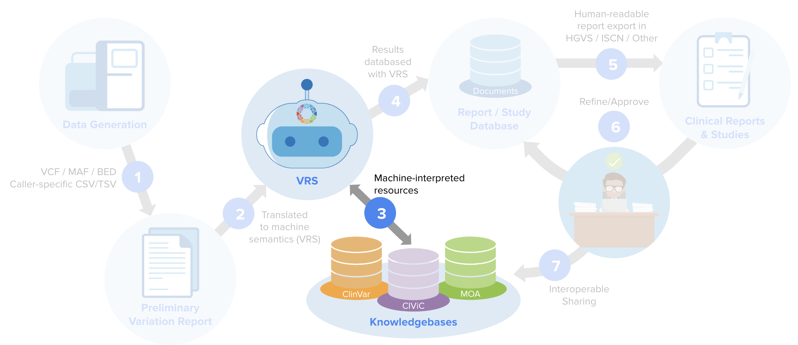

Genomic Knowledge Pilot
!!!!!!!!!!!!!!!!!!!!!!!

.. note::

   GK-Pilot is a joint Driver Project initiative for trialing genomic knowledge
   specifications to real-world datasets. **The contents of this resource are not a GA4GH
   standard**. This project is ongoing and the documentation here will continue to be developed
   as the pilot project progresses.
   We encourage community members with related genomic knowledge resources
   to propose addition of those resources under this shared framework in the `project
   issue tracker <https://github.com/ga4gh/gk-pilot/issues>`_.

The GA4GH has identified implementation support as a `roadmap imperative
<https://www.ga4gh.org/how-we-work/2020-2021-roadmap/>`_. To address this imperative, the
GKS Work Stream developed this project to:

   1. develop and expose the "starter kit" of tools, schemas, and workflows used to generate standardized genomic knowledge statements
   #. apply the starter kit to create open, versioned, standardized genomic knowledge datasets
   #. demonstrate utility of these datasets through open-source analysis notebooks

   The Genomic Knowledge Pilot project provides a first look at implementing the GKS specifications
   to drive interoperable knowledge exchange and search. The initial pilot project focuses on
   standardizing content from the open-access `ClinVar`_, `CIViC`_, and `Molecular Oncology Almanac`_
   resources.

.. toctree::
   :maxdepth: 2
   :includehidden:

   schema
   tools
   downloads
